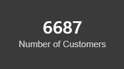
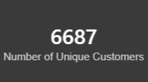
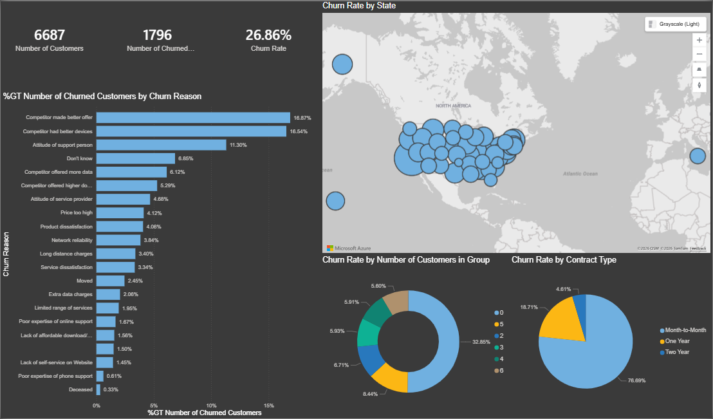
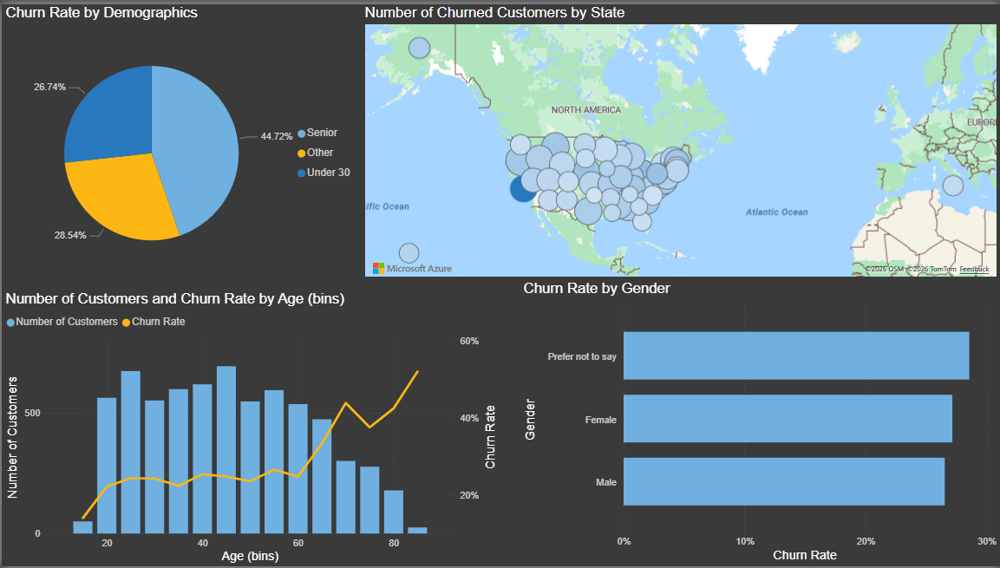
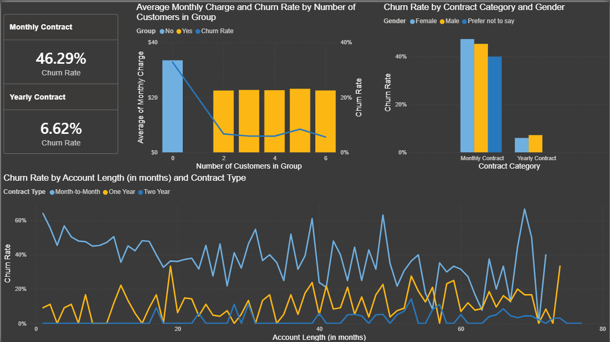
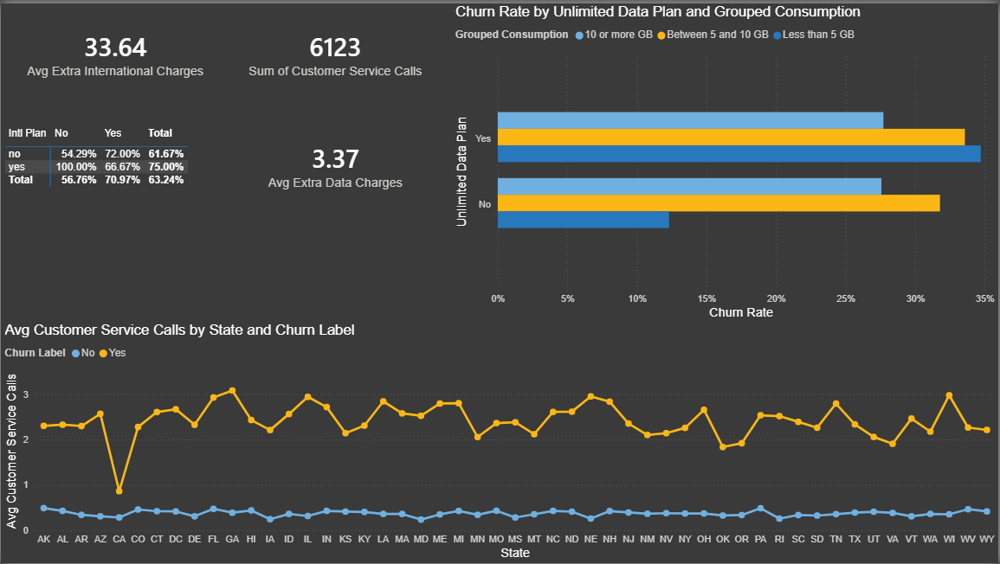

# Telecom Customer Churn Analysis — Power BI

## Project Overview

This project is a case study and part of the Datacamp Power BI for Data analyst track. We'll analyze churn rate by investigating a dataset from a fictional telecom company called Databel. 
The goal is to identify churn patterns, understand why customers leave, and provide data-driven recommendations to improve customer retention.

---

## Business Problem

Business wise, churn rate is the measurement of customers who choose to stop doing business with a company during a given period. 

High churn rates are a strong warning signal for telecom providers and require immediate action.  
As BI analysts, our role is to:

- Measure churn accurately  
- Identify main churn drivers  
- Segment churners  
- Support management decisions  

---

## Dataset Overview

The dataset comes from Databel, a fictional telecom company, and contains:

- Customer status: Customer ID, Churn Label, Churn Reason, Churn Category  
- Demographics: Gender, Age, Under 30, Senior  
- Contract details: Contract Type, Payment Method, State  
- Usage and charges: Account Length, International Calls, Avg Monthly GB Download, Customer Service Calls, Extra Charges  

---

## Project Roadmap

### 1. Data Preparation and Validation

- Loaded the dataset into Power BI  
- Checked for duplicates using:
  - Number of Customers
  - Number of unique customers
- No duplicates were detected

### 2. Data Exploration and Feature Engineering

#### Calculated Columns

- Churned: binary indicator derived from Churn Label  
- Age Group: Under 30 / Senior / Other  
- Age Bins  
- Contract Category: Monthly vs Yearly contracts
- Grouped Consumption:
  - Less than 5 GB  
  - Between 5 and 10 GB  
  - 10 GB or more  

#### Calculated Measures

- Number of churned customers  
- Average customer service calls  
- Average extra international charges  
- Average extra data charges  

### 3. Business Questions

- What is the overall churn rate?  
- What are the main churn reasons?  
- Which customer segments churn the most?  
- Which states have the highest churn?  
- How do contract type and usage impact churn?  

---

## Dashboard Pages

The Power BI report contains four main pages:

- Overview  

### Objective

This page provides a summary of customer churn at Databel.  
It answers the following questions:

- How many customers does the company have?
- How many have churned?
- What is the churn rate?
- Why are customers leaving?
- Where are churners located?

### Visuals and Data Used

**KPI Cards**

- Number of Customers  
- Number of Churned Customers  
- Churn Rate  

**Churn Reasons Bar Chart**

Shows the percentage distribution of churn reasons among churned customers.

Top contributors include:

- Competitor made better offer  
- Competitor had better devices  
- Attitude of support person   

**Churn by State Map**

Bubble map representing the number of churned customers by US state.

- Larger bubbles indicate higher churn volumes
- Helps identify geographic hotspots

Identifying CALIFORNIA as the state with the highest number of churners

**Donut and Bar Charts**

- Churn Rate by Number of Customers in Group  
- Churn rate by Contract Type  

These visuals highlight that customers without group subscriptions churn the most, while long-term contracts represent more stable segments.

### Key Takeaways

- Roughly one quarter of Databel’s customers have churned.
- Competition is the main churn driver.
- Customer service quality is a major contributor.
- Group plans and long-term contracts reduce churn risk.
- Certain states should be prioritized for retention efforts.

---

- Demographics  
 

### Objective

This page explores churn patterns across age groups, demographic categories, and geographic locations.

### Visuals and Data Used

**Churn Rate by Demographics**

Pie chart splitting customers into:

- Senior 
- Other  
- Under 30   

Senior customers show the highest churn proportion.

**Number of Customers and Churn Rate by Age Bins**

Combo chart displaying:

- Bars: Number of customers  
- Line: Churn rate  

Reveals increasing churn among older age groups.

**Number of Churned Customers by State**

Geographic map identifying states with the largest churn volumes.

### Key Takeaways

- Senior customers represent the most vulnerable group.
- Churn increases significantly after age 60.
- Geographic clusters indicate where retention actions should be prioritized.
- Demographics amplify churn risk but are secondary to contract type.

---

- Contract Information  
 pour ajouter une image

### Objective

This page focuses on understanding how contract structure, tenure and usage behavior influence churn.

### Visuals and Data Used

**Cards**

- Monthly Contract Churn Rate  
- Yearly Contract Churn Rate  

These cards highlight the strong contrast between short-term and long-term contracts.

**Average Monthly Charge and Churn Rate by Group Size**

Combo chart comparing:

- Bars: Average monthly charge  
- Line: Churn rate  

It shows that churn is highest for customers without group plans, while pricing remains relatively stable across groups.

**Churn Rate by Contract Category and Gender**

Clustered bars comparing churn across genders and contract categories.

- Monthly contracts show high churn for all genders.
- Yearly contracts are consistently low.

**Churn Rate by Account Length and Contract Type**

Line chart tracking churn over time for:

- Month-to-month  
- One-year  
- Two-year  

Demonstrates that long-term contracts stabilize customers, while month-to-month users remain highly volatile.

### Key Takeaways

- Contract type is the strongest churn driver.
- Month-to-month customers are the highest-risk segment.
- Group subscriptions reduce churn.
- Gender has limited impact compared to contract length.
- Tenure alone does not protect short-term contracts.

---

- Subscription Types and Charges  
 pour ajouter une image

### Objective

This page focuses on identifying the main behavioral and pricing-related drivers of customer churn by analyzing:

- The impact of **Unlimited Data Plans**
- Customers’ **monthly data consumption**
- **Extra charges** 
- The volume of **Customer Service calls**
- Geographic differences across U.S. states

The goal is to highlight high-risk customer profiles and uncover operational or pricing issues that may increase churn.

### Visuals and Data Used

#### Cards – Charges and Support Activity

These cards summarize key numeric indicators:

- **Avg Extra International Charges (33.64)**  
- **Avg Extra Data Charges (3.37)**  
- **Sum of Customer Service Calls (6123)**  

#### Table – Churn Rate by International Plan

This matrix compares churn rates for customers who:

- Have an international plan
- Use their international plan

It shows how international plan usage relates to churn behavior.

#### Bar Chart – Churn Rate by Unlimited Data Plan and Grouped Consumption

This horizontal bar chart combines:

- Unlimited Data Plan status (Yes / No)
- Grouped monthly data usage:
  - Less than 5 GB
  - Between 5 and 10 GB
  - 10 GB or more

It displays churn rates for each combination, highlighting how plan suitability affects retention.

#### Line Chart – Avg Customer Service Calls by State and Churn Label

This chart shows, for every U.S. state:

- The average number of support calls made by customers who churned
- The average number of calls made by retained customers

It reveals geographic patterns and emphasizes the gap in service interaction between churners and loyal customers.

### Key Takeaways

- Customers who churn consistently contact customer support far more often than retained customers
- Customers without an Unlimited Data Plan who consume medium to high amounts of data show elevated churn
- Some customers with Unlimited plans but **low consumption** also churn more
- Higher international and data overage charges are associated with increased churn.

---

## Tools Used

- Power BI Desktop  
- Power Query  
- DAX  
- DataCamp case study  

