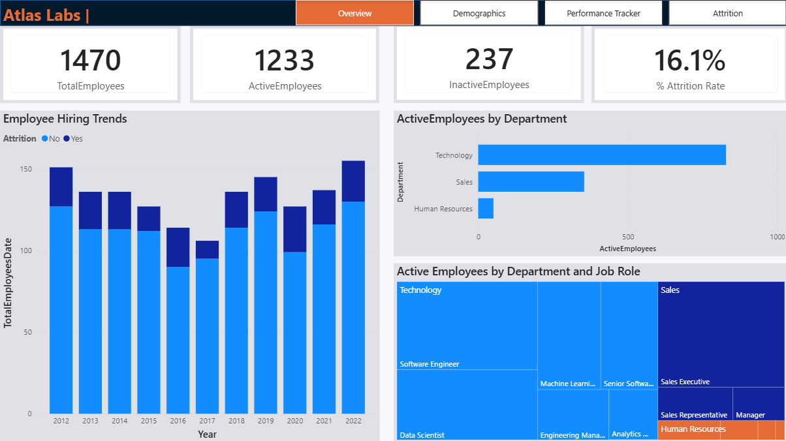
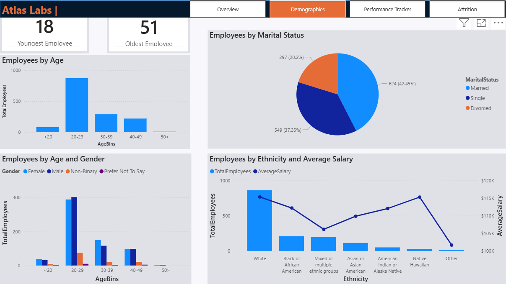
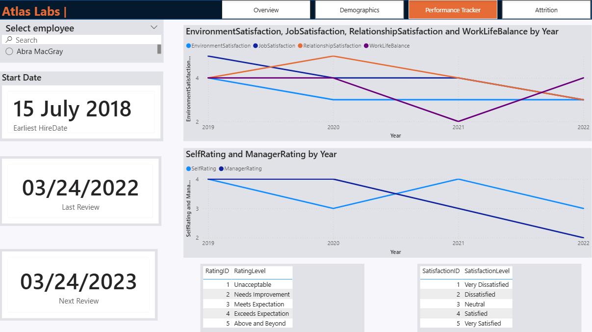
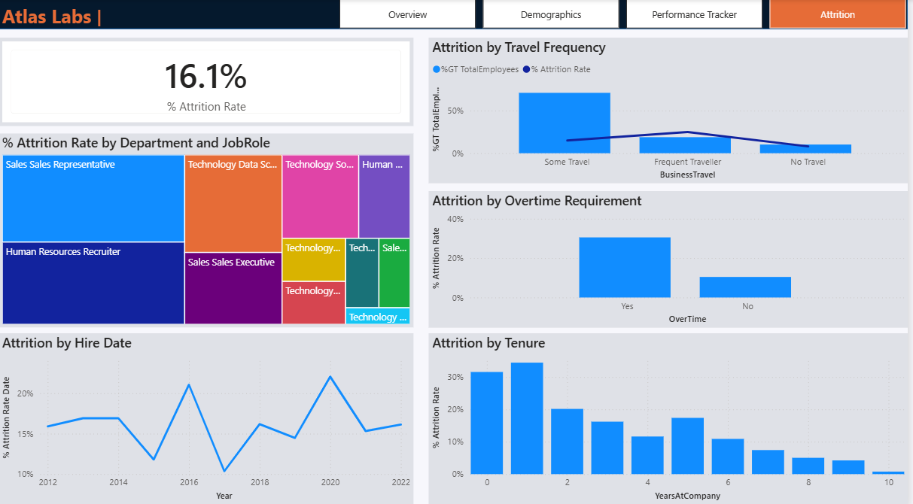

# HR Analytics & Attrition Analysis - Power BI

## Project Overview

This project is a Power BI case study based on a fictitious software company called **Atlas Labs**.

The objective of this analysis is to explore Human Resources data, build a robust data model, perform exploratory data analysis (EDA), and uncover the key drivers behind employee attrition.

Using Power BI, DAX, and data modeling best practices, this project delivers an interactive HR dashboard that enables leadership to:

- Monitor workforce metrics  
- Analyze hiring trends  
- Track employee performance  
- Evaluate diversity & inclusion metrics  
- Understand and reduce employee attrition  

---

## Business Problem

Employee attrition refers to employees leaving an organization — voluntarily or involuntarily and are not being replaced immediately.

High attrition can lead to:

- Decrease in the size of an organization  
- Increased recruitment and training costs   
- Reduced team productivity  

The leadership team at Atlas Labs wants visibility into:

- Overall attrition rate  
- Hiring growth trends  
- Department-level workforce distribution  
- Performance review trends  
- Demographic patterns  
- Factors impacting employee turnover  

As a Data Analyst, the goal is to transform raw HR data into actionable insights.

---

## Dataset & Data Modeling

The case study includes multiple HR-related datasets:

- Employee information  
- Performance ratings  
- Education level 
- Satisfaction level  
- Rating level 

### Data Preparation Steps

- Loaded and renamed multiple datasets  
- Verified and corrected data types  
- Created a dedicated **Date table (DimDate)**  
- Built a **star schema data model**
- Used `USERELATIONSHIP()` where required

---

## Calculated Measures & Columns (DAX)

Key DAX measures created in this project:

- `TotalEmployees`
- `InactiveEmployees`
- `% Attrition Rate`
- `TotalEmployeesDate` (using `CALCULATE()` + `USERELATIONSHIP()`)
- `InactiveEmployeesDate`
- `% Attrition Rate Date`
- `AverageSalary`
- `LastReviewDate`
- `JobSatisfaction`
- `EnvironmentSatisfaction`
- `RelationshipSatisfaction`
- `WorkLifeBalance`
- `SelfRating`
- `ManagerRating`

---

# Dashboard Pages

The Power BI report contains four main pages:

---

# Overview

## Objective

Provide leadership with a snapshot of the organization’s workforce and attrition.

## Key Metrics

- Total Employees  
- Active Employees  
- Inactive Employees  
- % Attrition Rate  

## Key Visuals

- Hiring Trends Over Time  
- Active Employees by Department  
- Active Employees by Department and Job Role  

## Insights

- The organization experienced steady hiring growth.
- Technology represents the largest department.
- Attrition rate stands at 16.1%.

---

# Demographics

## Objective

Analyze workforce composition, Diversity and Inclusion metrics.

## Focus Areas

- Age distribution  
- Gender breakdown  
- Marital status  
- Salary distribution by ethnicity  

## Key Insights

- The 20–29 age group represents the largest workforce segment.
- Workforce is predominantly single and married employees.
- Salary differences appear across ethnic groups. 

Demographic patterns provide additional context but are not the sole drivers of attrition.

---

# Performance Tracker

## Objective

Track individual employee performance over time.

## Features

- Yearly review tracking
- Self vs Manager ratings comparison
- Satisfaction metrics over time:
  - Job Satisfaction
  - Environment Satisfaction
  - Relationship Satisfaction
  - Work-Life Balance

## DAX Highlights

- Used `USERELATIONSHIP()` to activate inactive satisfaction relationships.
- Calculated latest review date dynamically.
- Created rating interpretation tables.

## Key Insights

- Manager ratings trend downward over time for this employee.
- Satisfaction metrics fluctuate year-over-year.

---

# Attrition

## Objective

This page focuses on helping HR understand **employee attrition patterns** and identifying the key drivers behind workforce turnover at Atlas Labs.

---

## Key Metrics

- **Attrition Rate:** 16.1%

This KPI provides an overall view of workforce turnover and serves as a baseline for deeper analysis.

---

## Visuals and Analysis

- Attrition by Department and Job Role
- Attrition by Travel Frequency
- Attrition by Overtime Requirement
- Attrition by Tenure
- Attrition Trend by Hire Date

---

## Key insights

- Overtime is one of the strongest attrition drivers.
- Early tenure employees are the most vulnerable to leaving.
- Certain job roles experience disproportionately high attrition rate.
- Travel frequency contributes to employee churn.

---

## Business Recommendations

Based on the HR analysis conducted for Atlas Labs, several actionable recommendations can be proposed to reduce employee attrition

- Reduce Early-Tenure Attrition
- Monitor Overtime and Workload Balance
- Reassess Travel Requirements
- Target High-Risk Roles and Departments
- Strengthen Performance & Satisfaction Monitoring

---

## Key Skills Demonstrated

This project demonstrates practical skills, including:

- Data modeling using **star schema** in Power BI  
- EDA
- Advanced DAX (`CALCULATE`, `USERELATIONSHIP`, time intelligence)  
- HR analytics and attrition driver identification  
- KPI design aligned with business objectives  
- Interactive dashboard development  
- Data storytelling and insight communication  
- Report design and visual hierarchy optimization
---

## Tools Used

- Power BI Desktop  
- Power Query  
- DAX  
- Star Schema Data Modeling  

---

## Conclusion

By combining strong **data modeling**, **advanced DAX**, and **clear business storytelling**, the report provides Atlas Labs with the necessary insights to:

- Reduce attrition  
- Improve employee satisfaction  
- Optimize hiring strategies  
- Strengthen workforce planning  
---

